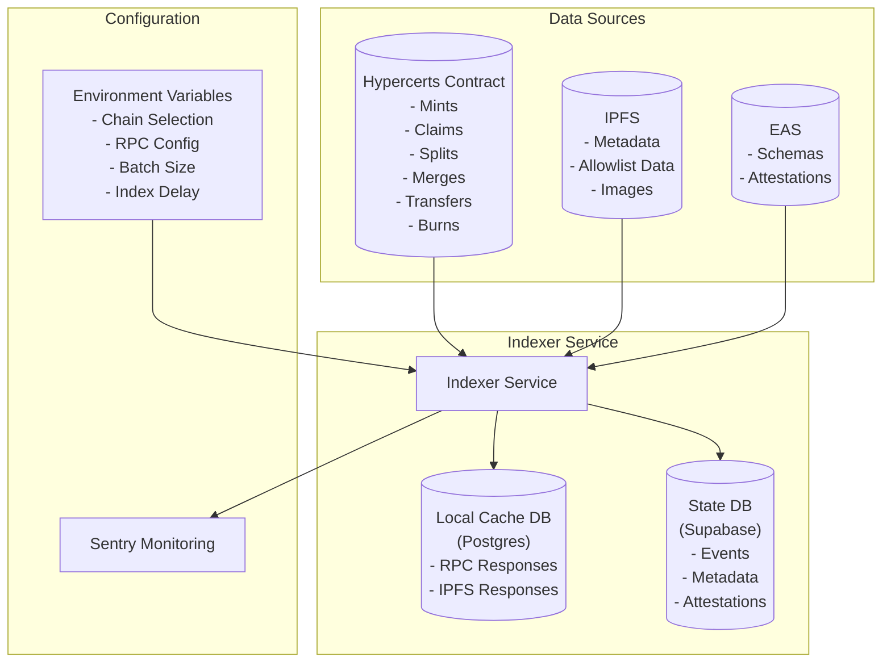

# Hypercerts Indexer

The hypercerts indexing service monitors the hypercerts contract and indexes the data into a postgres database for all supported chains on either testnets or production.

## Getting started

### Environment variables

#### Service

Determines the chains to index and the port to run the service on. Based on the environment, all relevant contract and events are fetched from the database and will be monitored.

#### Indexing

Determines the batch size and the delay between indexing runs.

#### RPCs

The API implements a fallback to the first available RPC. You can set the RPC keys in the `.env` file.

#### Databases

##### Local caching

The indexing service is paired with a local postgres database for caching purposes. When the service needs to do a remote call to an EVM or IPFS, the call and the response are cached in the local database. This reduces load and latency on the RPCs.

> We recommend using [Postgres.app](https://postgresapp.com/) to run the local caching database on MacOS.

#### Kysely

Kysely is implemented in favor of SupabaseJS as it allows for more flexibility and complexity in queries. To connect to the database you need to set the `DB_URL` in the `.env` file. By default, the local variables are set to the local Supabase instance.

##### Supabase

The indexing service is paired with a Postgres database for storing state provided by Supabase. Events for mints, transfers, claims and other relevant events are parsed and the state in the DB is updated. Additionally, the database provides a cache for the metadata of hypercerts and parses attestations.

#### Sentry

Sentry is used for monitoring and error reporting. You can read more about it [here](https://docs.sentry.io/platforms/javascript/guides/node/configuration/env-vars/). When Sentry is set to `local` it will be disabled by default.

### Run the Indexer locally

`pnpm dev`

## Deployments

The indexing services are deployed on Railway and not publicly exposed.

## Scripts

- `dev`: Starts the development server using `nodemon`, which will automatically restart the server whenever you save a file that the server uses.
- `build`: Compiles the TypeScript code into JavaScript using `swc`. The compiled code is output to the `dist` directory.
- `start`: Starts the application in production mode. 
- `test`: Runs tests using `vitest`
- `test:coverage`: Runs tests and generates a coverage report.
- `test:integration`: Runs integration tests using `vitest`.
- `supabase:reset`: Resets the Supabase database and generates the TypeScript types for the database.
- `supabase:seed`: Seeds the Supabase database with test data.
- `supabase:types`: Generates the TypeScript types for the caching database (indexer).
- `supabase:types:data`: Generates the TypeScript types for the data database (api).
- `update:sentry:sourcemaps`: Updates the Sentry source maps.

## Data

The indexer service monitors supported chains and gathers data from multiple sources based on the observed events.

### Hypercerts minter

> Mints, allowlist claims, splits, merges, transfers, burns, etc.

The hypercerts minter contract is monitored for minting events. When a minting event is observed, the data is indexed into the local caching database. In addition to minting events, the indexer also monitors the hypercerts contract for allowlist claims, splits, merges and other state changes.

### IPFS

> Metadata, allowlist data, images, etc.

Hypercerts created via our stack store the metadata on IPFS. The indexer fetches the metadata from IPFS and stores it in the local caching database and writes it to the caching database for the API.

### EAS - Ethereum Attestation Service

> Schemas and attestations.

[EAS](https://attest.sh/) utilizes schemas to define the structure of the data stored in the attestations. The indexer database is seeded with the schemas from the EAS contract. When an attestation is observed, the indexer fetches the schema from the database and decodes the attestation data. The decoded data is then indexed into the local caching database.

## Architecture

